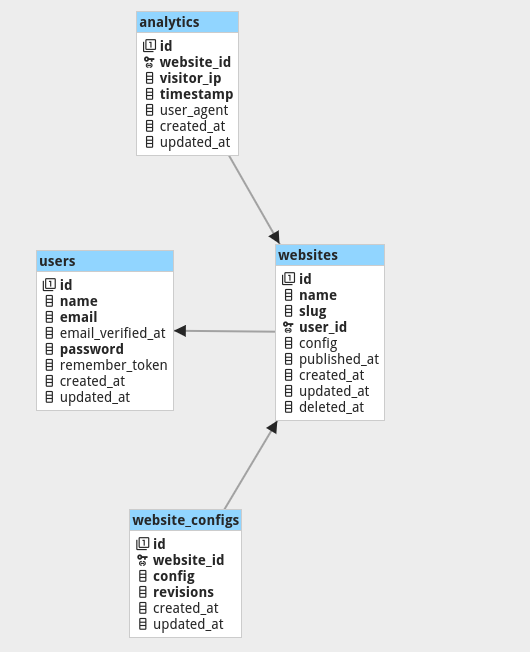

# DATABASE SCHEMA

The database schema is relatively simple. There are 4 tables:
- `users` - stores user information
- `website` - stores website information, mainly `name`, `slug` (for SEO) and `config`.
- `website_config` - stores changes made to a website.
  - `config` stores the most recent update, pending to be published. This is show in preview mode.
  - `revisions` tracks past changes made to the site.
- `analytics` - stores user's device information when browsing the client page

!
